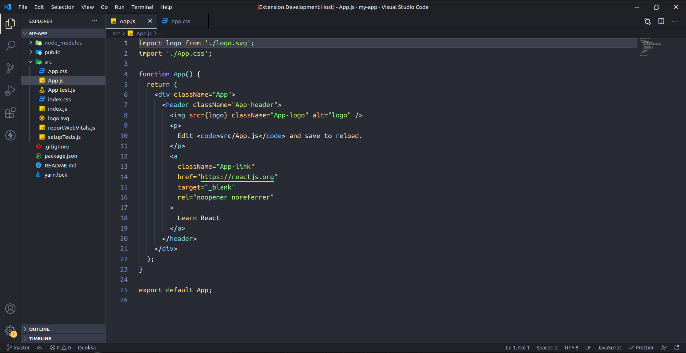
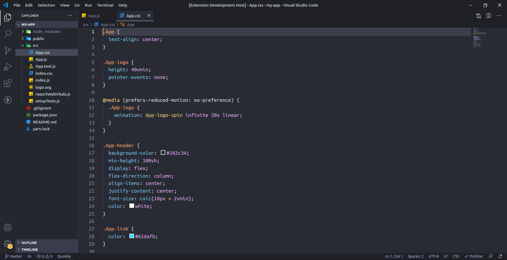
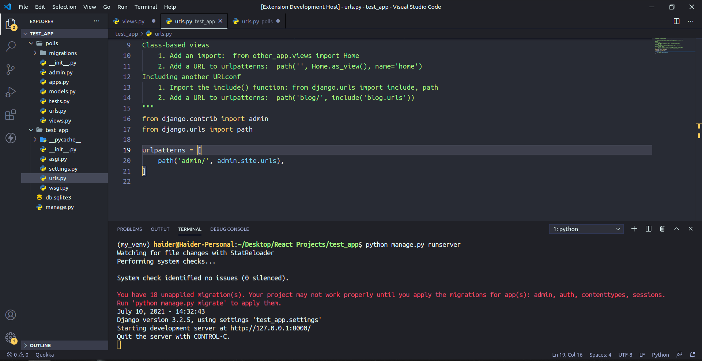

# Haida Theme

A minimalist dark grey theme that works just as well in the day as it does at night

## Color Reference

### Syntax Colors

| Color                                                            | Hex                                               |
| ---------------------------------------------------------------- | ------------------------------------------------- |
|  #BAE67E | Strings                                           |
|  #FFD580 | Classes, Object Literals                          |
|  #89CFF0 | Function Calls, Special Methods, CSS Classes      |
|  #E2C5FF | Constants, Keywords, Function & Class Definitions |

### Syntax Colors

| Color                                                            | Hex               |
| ---------------------------------------------------------------- | ----------------- |
|  #282C34 | Primary Workbench |

## Screenshots

## Issues

The theme is not yet perfect, if you find an issue do not hesitate to mention it
